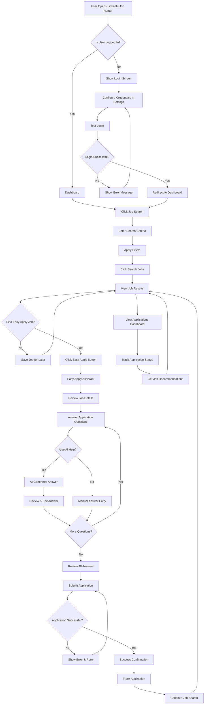

# User Journey Flow: Login → Job Search → Easy Apply

## Complete User Flow Diagram

## Key Decision Points

### 1. Authentication Flow
- **Entry Point:** User accesses application
- **Decision:** Is user already logged in?
- **Actions:** Configure credentials → Test login → Redirect to dashboard

### 2. Job Search Flow
- **Entry Point:** Dashboard or direct navigation
- **Actions:** Enter criteria → Apply filters → View results
- **Decision:** Are there Easy Apply jobs available?

### 3. Easy Apply Flow
- **Entry Point:** Job search results
- **Actions:** Select job → Access assistant → Complete form
- **Decision:** Use AI help or manual entry?

### 4. Application Submission Flow
- **Entry Point:** Completed application form
- **Actions:** Review answers → Submit → Confirm success
- **Decision:** Application successful?

### 5. Post-Application Flow
- **Entry Point:** Successful application
- **Actions:** Track application → Continue searching → View dashboard

## User Experience Touchpoints

### High-Touch Moments
1. **First Login:** Credential setup and verification
2. **Job Discovery:** Finding relevant opportunities
3. **Easy Apply Decision:** Choosing to use AI assistance
4. **Application Submission:** Final review and submission
5. **Success Confirmation:** Positive feedback and next steps

### Error Recovery Points
1. **Login Failures:** Clear error messages with retry options
2. **Search Issues:** Alternative suggestions and filter adjustments
3. **AI Service Unavailable:** Fallback to manual form completion
4. **Application Failures:** Retry mechanisms with detailed error information

## Success Indicators

### User Progress Tracking
- ✅ Credentials configured and tested
- ✅ Job search performed with results
- ✅ Easy Apply job identified
- ✅ Application questions answered
- ✅ Application submitted successfully
- ✅ Application tracked in dashboard

### Performance Metrics
- **Time to First Job:** <2 minutes from login
- **Time to Application:** <5 minutes from job selection
- **Application Success Rate:** >90%
- **User Satisfaction:** >4.5/5 rating

## Integration Points

### External Systems
- **LinkedIn API:** Job search and authentication
- **Gemini AI:** Intelligent form completion
- **Browser Automation:** Easy Apply processing
- **Local Storage:** Application tracking and preferences

### Internal Components
- **Frontend React App:** User interface and interactions
- **API Bridge:** Backend communication layer
- **MCP Tools:** LinkedIn automation services
- **Session Management:** User state and authentication

## Error Handling Strategy

### Graceful Degradation
1. **AI Unavailable:** Manual form completion
2. **LinkedIn Down:** Cached job results
3. **Network Issues:** Offline mode with queued actions
4. **Browser Issues:** Alternative submission methods

### User Communication
- **Clear Error Messages:** Specific, actionable feedback
- **Progress Indicators:** Loading states and progress bars
- **Success Confirmations:** Positive reinforcement
- **Next Steps Guidance:** Clear direction for continued use

## Optimization Opportunities

### Performance Improvements
- **Caching:** Job results and user preferences
- **Preloading:** Common form questions and AI responses
- **Background Processing:** Non-blocking operations
- **Progressive Enhancement:** Core functionality first, AI features second

### User Experience Enhancements
- **Smart Defaults:** Pre-filled common answers
- **Contextual Help:** Inline assistance and tooltips
- **Keyboard Shortcuts:** Power user features
- **Mobile Optimization:** Responsive design and touch interactions 